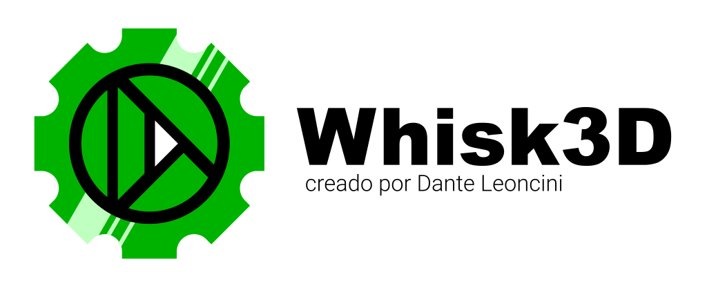

# Whisk 3D

<p align="center">
    
</p>

## Motor multiplataforma 2D y 3D estilo retro

Whisk3D es una herramienta de creación 2D/3D estilo retro, con el objetivo de llevar el modelado, render, animación y desarrollo de videojuegos a cualquier dispositivo, incluso aquellos “Obsoletos”.

Nació como un clon liviano de Blender para Nokia, pero hoy es mucho más: un entorno creativo, centrado en la estética low-poly y la identidad visual de PlayStation, Dreamcast y la PC retro. Whisk3D prioriza la velocidad, la accesibilidad y la diversión por encima de la complejidad excesiva.

## ¡Software Libre!

La licencia MIT permite que cualquiera pueda usarlo libremente para crear juegos, proyectos comerciales, educativos o artísticos, e incluso hacer forks y expandir la herramienta sin restricciones.

**Aun esta en pre-alpha**, una primera mirada a algo que todavía está creciendo, pero con una visión clara: que cualquier persona pueda modelar, animar, diseñar, renderizar y desarrollar juegos 3D sin necesitar una PC moderna ni enfrentar curvas de aprendizaje intimidantes.
Whisk3D se construye con una filosofía sencilla: **el hardware no debería morir por el software**. Busco demostrar que la obsolescencia programada puede revertirse desde el código, que una máquina considerada “vieja” puede seguir creando, imaginando y generando contenido nuevo.

El proyecto, y los videojuegos que se desarrollen con él, planean sostenerse mediante donaciones voluntarias, **no con microtransacciones, publicidad molesta, loot boxes, ni mecanismos diseñados para generar adicción o manipular al jugador.**
Whisk3D **NO** instala servicios ocultos, no espía al usuario ni vende sus datos, no exige cuentas ni conexión permanente. **Respetamos a los creadores y jugadores**.

Queremos **devolverte el control de tu software**, democratizar la creación y permitirle a las nuevas generaciones experimentar con el 3D ****sin barreras técnicas ni económicas**.


YouTube: [Youtube Video](https://youtu.be/dMe-Vit5OT0)

## Instalacion en Symbian:

Necesitas tener instalado PyS60, o el programa no se ejecutará, Se ha incluido el instalador in la carpeta "Dependencies" del repositorio. La última versión estará siempre en la carpeta "sis" con el nombre de "Whisk3D_gcce.sisx", aunque la última versión quizás no funcione correctamente, la versión verificada estará siempre en la carpeta "releases" con la fecha de salida y nombre referenciando los videos e imágenes de demostración mostrados en [Instagram](https://www.instagram.com/dante_leoncini?igsh=MWpjYTd5YzU5dTBkNg==). 

Este programa no esta listo para producción y tiene una serie de errores conocidos, se encuentra en constante desarrollo, y se esta constantemente añadiendo o quitando características. Por ejemplo, la opción para modelado 3d ha sido removida en las últimas versiones, pero si usas una versión anterior como "Whisk3D_gcce_beta_24-08-15_FERNET.sisx", el modelado 3d sigue disponible.

Sí el instalador falla, probablemente debas de "hackear" tu teléfono para ignorar las restricciones y certificados de Symbian. Puedes ver el siguiente video mostrando como hacerlo: [Tutorial Hack](https://www.youtube.com/watch?v=UJJICzbk3TA)

## Linux

Para compilar en Linux/Ubuntu hace falta instalar las dependencias y bajar los submodulos de git con el siguiente copmando:

```bash
git submodule update --init --recursive
```

en la carpeta raiz usar cmake y los siguientes comandos:

```bash
cmake -B build-linux -DCMAKE_BUILD_TYPE=Release
cmake --build build-linux --config Release -- -j8
```

Pra debug:

```bash
cmake --build build-linux --config Debug -- -j8
gdb ./build-linux/whisk3d
run
```

si crashea podes ver con detalle en que parte usando

```bash
bt full
```

Para generar los instaladores .DEB, RPM o AppImage. en la carpeta /buld-linux pueden usar el siguiente comando:

```bash
cpack
```

Nota: para creas los AppImage el Cmake que viene en ubuntu no sirve. podes instalarlo de la siguiente forma. actualiza cmake

```bash
pip install cmake --upgrade
```

necesitas "patchelf" y "appimagetool", podes instalarlos de la siguiente forma

```bash
sudo apt install patchelf
wget https://github.com/AppImage/AppImageKit/releases/download/continuous/appimagetool-x86_64.AppImage
chmod +x appimagetool-x86_64.AppImage
```

y ahora con "cpack" los generas. excelente aporte de [**Zariep**](https://github.com/ItsZariep)

## Android

Para compilar. desde el directorio raiz usa
cd platform/android && ./gradlew assembleDebug

## Windows

Para compilar. 

1) en la carpeta raiz "git submodule update --init --recursive" (para tener los submodulos de SDL2 y SDL2_image)
2) Instalar Visual Studio Code 2019 o mas nuevo y cmake desde https://cmake.org/download/
3) si no lo tenes, en "Visual Studio Installer" vas a "Modificar" y tildas C++ Desktop Development "MSVC v142 - VS 2019 C++ x64/x86 Build Tools (Latest)", "C++ CMake tools for Window" y "Windows 10 SDK 10.0.19041.0" (o superior)
4) Abrí Inicio → escribí Developer Command Prompt for VS 2018 (o el que tengas)
5) anda al directorio cd C:\BLA BLA BLA\Whisk3D\platform\windows (aca adentro esta el CMakeLists.txt)
6) cmake -S . -B ../../build/windows/x64 -G "Visual Studio 18 2026" -A x64
7) cmake --build ../../build/windows/x64 --config Release

## Aclaraciones:

1. No es un port: Este programa **no comparte** código con Blender.
2. Obsolescencia programada: El objetivo del proyecto **es evidenciar la obsolescencia programada** de los teléfonos, antiguos como actuales. Busco generar una demanda por parte de los consumidores de teléfonos más sostenibles y duraderos, reduciendo la enorme cantidad de residuos electrónicos. también ayudaría a que mas gente acceda a la tecnología gracias al reciclaje de estos antiguos dispositivos.
3. Conocimiento en informática: Queremos resaltar la falta de conocimiento general en informática. No debería sorprender que Whisk 3D funcione en un Nokia N95, un teléfono que en su tiempo era de gama alta, comparable con un iPhone 17 Pro Max de hoy. Quiero dejar claro que con 300 MHz y 128 MB de RAM se pueden realizar tareas que hoy en día requieren teléfonos con 8 GB de RAM y procesadores multicore.
4. Renderización y trazado de rayos: Whisk 3D ya puede hacer renderizaciones. La renderización, en términos informáticos, es el proceso de generar una imagen a partir de un modelo 2D o 3D. Si bien aún no he implementado el trazado de rayos, el Nokia N95 es capaz de hacerlo mediante su CPU y FPU (Unidad de Punto Flotante). En películas como Terminator 2 y Jurassic Park, se utilizaron computadoras SGI Onyx de 1993. El Nokia N95, lanzado en 2007, tiene 14 años de diferencia y es comparable en cuanto a potencia. Es preocupante que tanta gente se sorprenda de que un teléfono antiguo pueda realizar un render.
5. Desempeño gráfico: Whisk 3D se ve fluido gracias a la **aceleración gráfica** por hardware del N95 (PowerVR MBX Lite) y su FPU, lo que permite mover modelos 3D complejos como Arthur Morgan de Red Dead Redemption 2.

 

## ¡Gracias!

Gracias a todos los que compartieron el proyecto. y a la gente que esta empezando a contribuir con el codigo
Gracias a Marcig por el nuevo nombre!

# ¡Participa!

Tengo pensado agregar mas funciones. 
Cualquier aporte que quiera realizar al código es Bienvenida.
